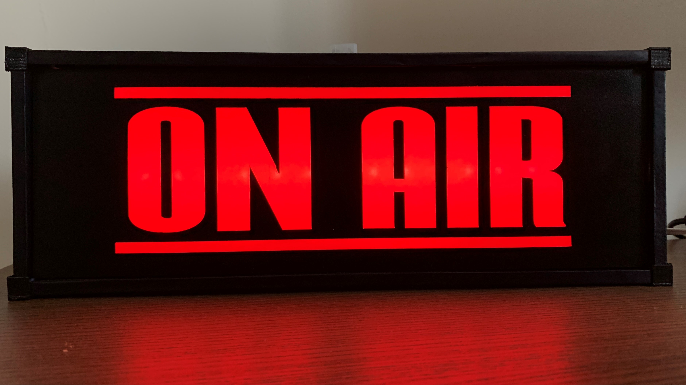
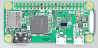
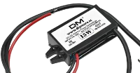
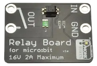

# Linking an "On Air" Sign to MS Teams Meetings #

## What is this this project about? ##
I've worked at home 1-2 days a week for many years now, but with the COVID pandemic, I - like so many others - found myself not only working at home full time, but I also was then taking part in many video calls and the rest of the family were at home too. Whilst I don't mind members of my family appearing on my video calls, they were less keen. So I wanted a way of notifying them when I was on a call. Yelling out "On a call" across the house wasn't popular, so I decided I needed a clear "on a call" sign instead. And I wanted it to automatically turn on and off when the call started and ended. So this project was born... 

## Project components ##

The project consists of three distinct components:
 - A C#-based Windows 10 application that monitors MS Teams
 - A Python based application that runs on a Raspberry Pi
 - An illuminated sign and associated hardware to allow the Raspberry Pi to turn it on and off

## OnAirTeamsClient - Monitoring MS Teams use of the Microphone and Webcam ##

This part of the project rook me the longest to work out how to reliably achieve it, yet when I found the solution, it was both simple and reliable.

The key to it is a feature of the Windows Registry released as part of Windows 10 version 1903: the "ConsentStore" keys. [As detailed in this blog post](https://svch0st.medium.com/can-you-track-processes-accessing-the-camera-and-microphone-7e6885b37072), information around when applications access various devices is stored in here. So delving into my registry using reg

### Parts List ###

The following is the list of parts I used. 

| | Item | UK Price | Notes |
|-|------|----------|-------|
|  | [On Air Light up Sign from Etsy](https://www.etsy.com/uk/listing/888654937/on-air-light-up-sign-usb-led-powered) | £25.00 | My choice here was based on: I liked the sign style, it has screw mounting holes on the back and was USB powered, so I knew I could run it from a 5v supply |
|  | [Raspberry Pi Zero W](https://www.raspberrypi.org/products/raspberry-pi-zero-w/) | £9.30 | Effectively any Raspberry PI will do here, as long as it has wifi support as the project only uses two GPIO pins |
|  | [DC-DC Converter 12V to 5V 3A Step Down Power Supply](https://www.ebay.co.uk/itm/Waterproof-DC-DC-Converter-12V-to-5V-3A-Step-Down-Power-Supply-Module-Micro-USB/224302880156) | £6.00 | Possible case of over-engineering here, but I needed over 8m of basic "bell wire" to run the power from a wall socket to the sign. I was concerned (probably unnecessarily) that the voltage drop along this cable would be too great if I used USB power. So I used a 12V supply (from a broken set of Christmas Tree lights) and this converter.
| | [Relay for micro:bit](https://cpc.farnell.com/monkmakes/sku00061/relay-for-micro-bit/dp/ED00382) | £6.94 | I wanted a solid state relay to allow the Pi to turn the sign on and off. I couldn't find a sensibly priced one for a Raspberry PI/Arduino, but I found this one which is designed to work with a BBC Micro:bit. It works with 3.3V, so does the job... |

In addition, I used an old 12V power supply, a length of basic bell wire, a red LED and - to create the diffuser for the LED, the plastic end cap from an HDMI cable.

